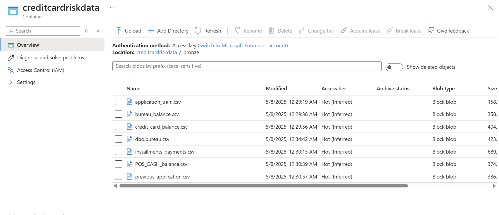
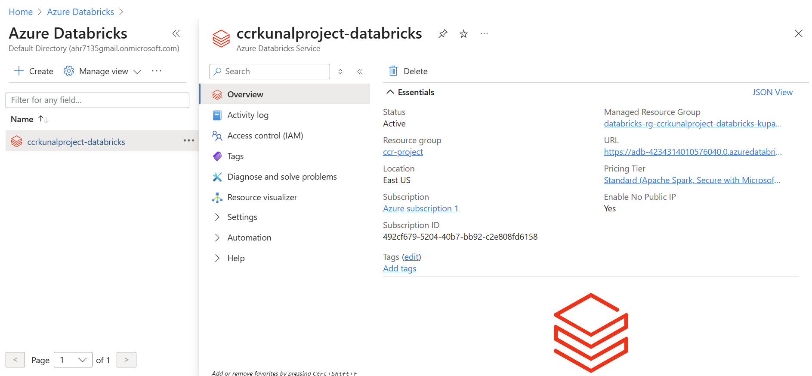
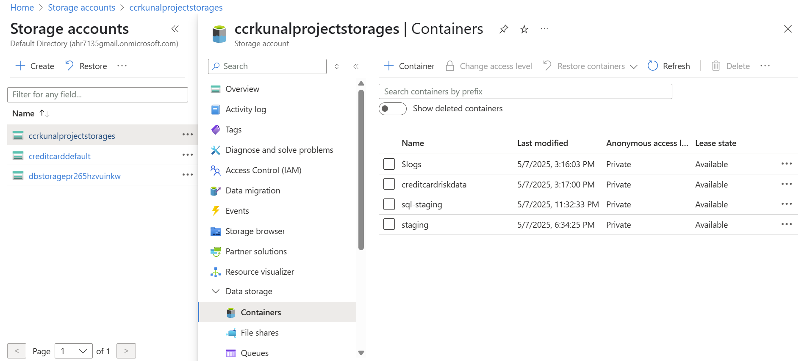

# Azure Credit Card Risk Analysis Project

This project implements a big data pipeline on Microsoft Azure to perform credit card risk analysis. The pipeline ingests raw data, processes it, and serves it for analytics and reporting.

## Architecture

The project follows a modern data warehouse architecture using several Azure services:

-   **Azure Data Factory (ADF):** For orchestrating the data ingestion and transformation pipelines from various sources like CSV files and SQL tables and MongoDb database
-   **Azure Data Lake Storage (ADLS) Gen2:** For storing raw, intermediate, and processed data in a tiered structure (Bronze, Silver, Gold).
-   **Azure Databricks:** For performing complex data transformations and feature engineering using Spark.
-   **Azure Synapse Analytics:** For serving the processed data for business intelligence and reporting.
-   **Power BI:** For creating interactive reports and dashboards.

Here is a high-level overview of the pipeline:


## Dataset

The project uses the following datasets:

-   `application_train.csv`
-   `bureau.csv`
-   `bureau_balance.csv`
-   `credit_card_balance.csv`
-   `installments_payments.csv`
-   `POS_CASH_balance.csv`
-   `previous_application.csv`
-   `HomeCredit_columns_description.csv`

Data Source - https://www.kaggle.com/c/home-credit-default-risk/data 

## Data Layers in ADLS Gen2

The data is organized into three layers in Azure Data Lake Storage:

-   **Bronze Layer:** Contains the raw, unaltered data ingested from source systems.
    

-   **Silver Layer:** Contains cleansed, and transformed data. Data from various sources is joined here. This layer is often used by data scientists for exploration.
    

-   **Gold Layer:** Contains aggregated and curated data, ready for consumption by analytics and reporting tools. This is the serving layer.
    

Here is the overall folder structure in ADLS:


## Implementation Details

### Data Ingestion and Orchestration

Azure Data Factory is used to orchestrate the entire ELT/ETL process. It ingests the raw CSV files and data from postgres database into the Bronze layer of the Data Lake. Then, it triggers the Databricks notebook for data transformation.


### Data Transformation

Azure Databricks is used to perform the heavy lifting of data transformation. The `CreditCard_Transformation_DatabricksCodes.ipynb` notebook reads data from the Bronze layer, performs cleaning, transformation, feature engineering, and joins the different datasets. The transformed data is then stored in the Silver layer in Parquet format. Further aggregations are performed and stored in the Gold layer.



### Data Serving with Azure Synapse Analytics

The Gold layer data is exposed as views in Azure Synapse Analytics for easy querying and integration with BI tools like Power BI.

Here are some of the views created in Synapse:

#### `applicant_risk_profiles`

This view provides a risk profile for each applicant.

```sql
CREATE VIEW dbo.applicant_risk_profiles AS
SELECT
    result.SK_ID_CURR,
    TRY_CAST(result.AMT_INCOME_TOTAL AS FLOAT) AS income,
    TRY_CAST(result.AMT_CREDIT AS FLOAT) AS credit,
    TRY_CAST(result.AMT_ANNUITY AS FLOAT) AS annuity,
    TRY_CAST(result.INCOME_CREDIT_RATIO AS FLOAT) AS income_credit_ratio,
    TRY_CAST(result.DAYS_EMPLOYED AS FLOAT) / NULLIF(TRY_CAST(result.DAYS_BIRTH AS FLOAT), 0) AS employment_ratio
FROM OPENROWSET(
    BULK 'https://ccrkunalprojectstorages.dfs.core.windows.net/creditcardriskdata/silver/',
    FORMAT = 'PARQUET'
) AS result
WHERE result.SK_ID_CURR IS NOT NULL;
```

#### `feature_insights_summary`

This view provides summary statistics grouped by income type.

```sql
CREATE VIEW dbo.feature_insights_summary AS
SELECT
    result.NAME_INCOME_TYPE,
    COUNT(*) AS applicant_count,
    AVG(TRY_CAST(result.AMT_INCOME_TOTAL AS FLOAT)) AS avg_income,
    AVG(TRY_CAST(result.AMT_CREDIT AS FLOAT)) AS avg_credit,
    AVG(TRY_CAST(result.INCOME_CREDIT_RATIO AS FLOAT)) AS avg_income_credit_ratio,
    AVG(TRY_CAST(result.TARGET AS FLOAT)) AS default_rate
FROM OPENROWSET(
    BULK 'https://ccrkunalprojectstorages.dfs.core.windows.net/creditcardriskdata/silver/',
    FORMAT = 'PARQUET'
) AS result
GROUP BY result.NAME_INCOME_TYPE;
```

The data from the gold layer is then exposed as external tables in Synapse.


## Azure Resources

Here are some screenshots of the Azure resources used in this project.

-   **Storage Account:**
    
    

-   **ADLS Lifecycle Management:**
     

- **Challenges Faced**

  -  Direct ingestion from Kaggle using ADF HTTP connector isn't supported due to required authentication.

   - Kaggle competition data cannot be publicly linked, so manual upload to ADLS Gen2 staging was used — an industry-standard workaround.
   - Connecting ADLS Gen2 to Databricks and Synapse required careful RBAC setup and endpoint configuration, which was tricky to get right.
    
   - Resource allocation issues in East US during free-tier deployment required setting up all services in West US instead.
